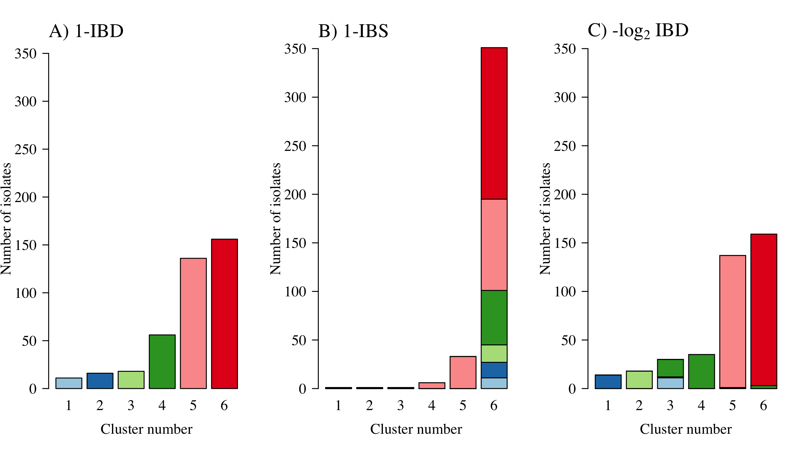
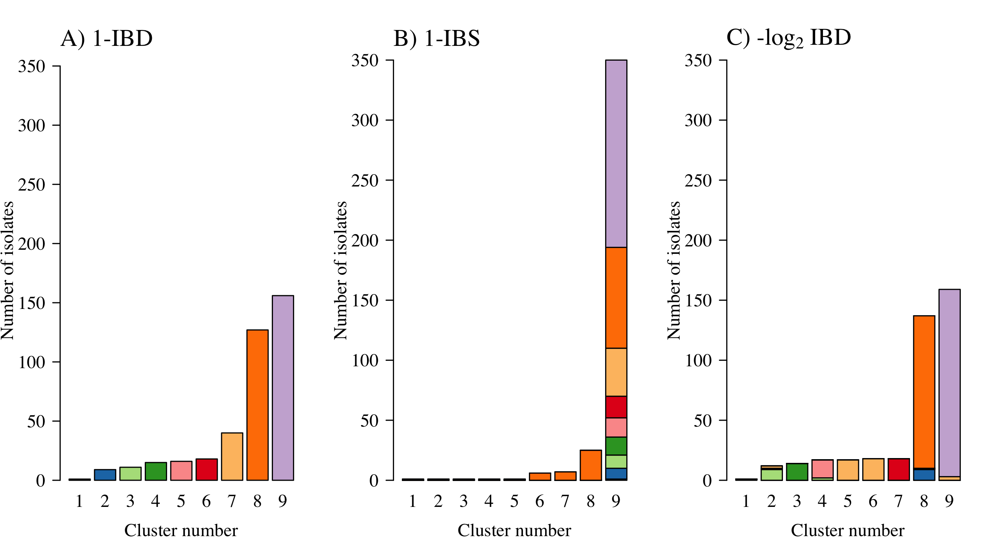
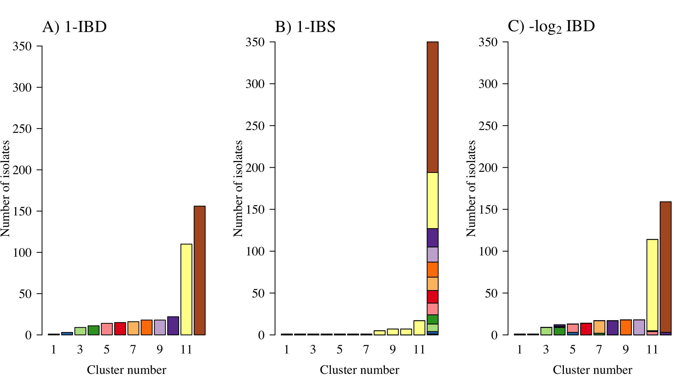
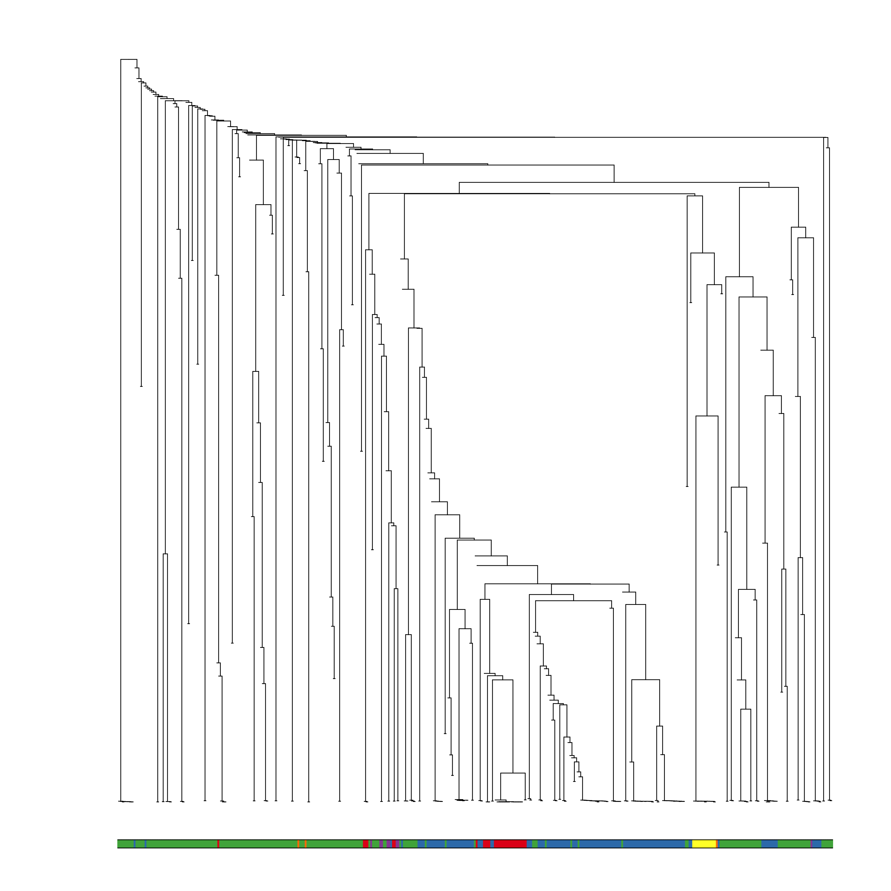
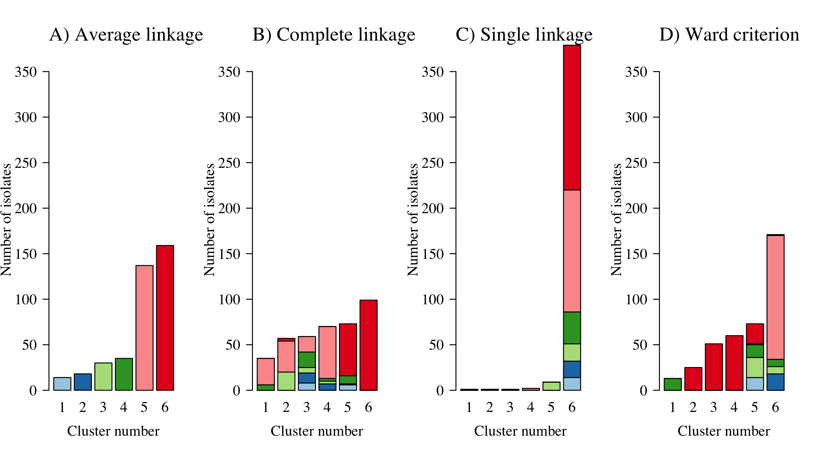
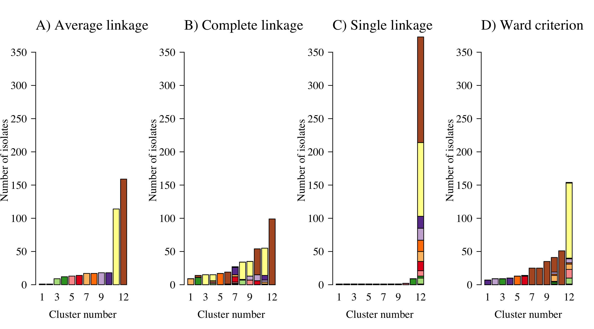
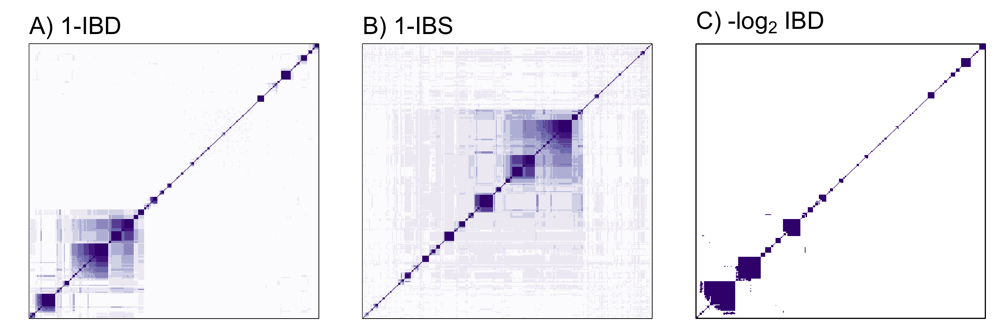
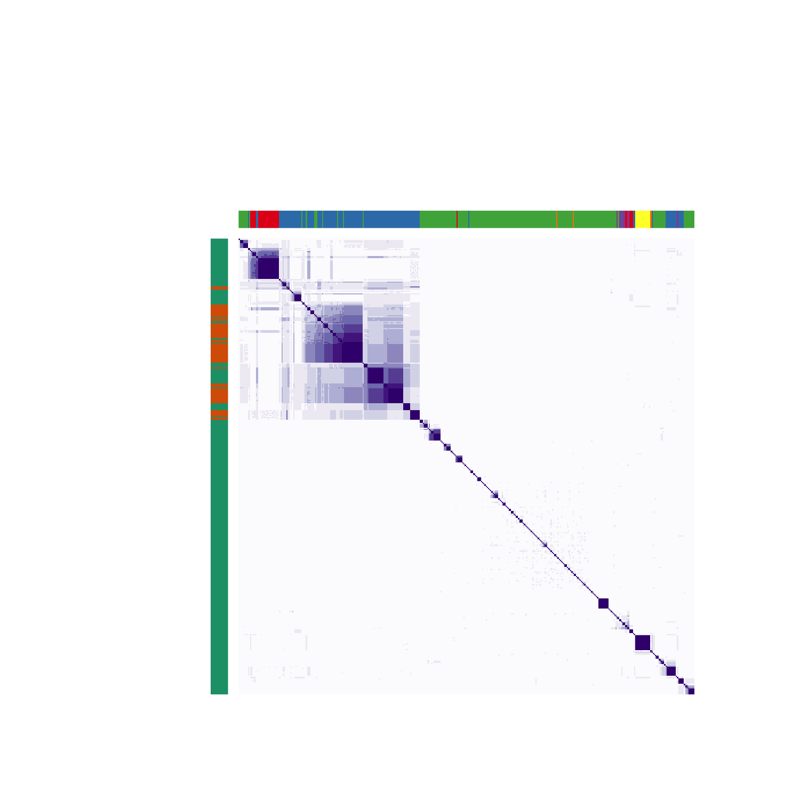
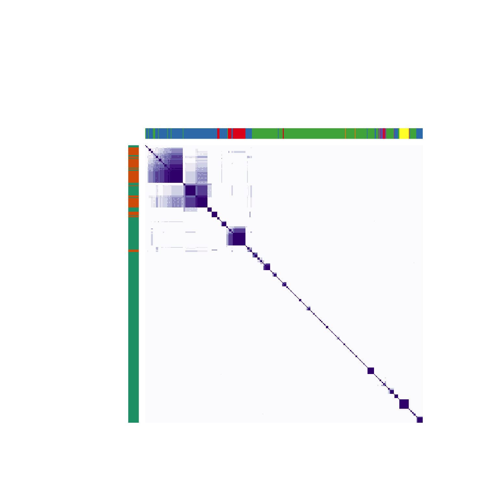

## Load meta data and pairwise distance matrices


```r
# meta data on 393 individuals in the TRAC1 study
load('RData/metadata.RData')

# 393 x 393 whole genome based 1-IBS distance matrix
load(file = 'RData/IBD_distance_matrix.RData')
IBD_WG = IBD_dist_matrix

# 393 x 393 whole genome based 1-IBD distance matrix
load(file = 'RData/IBS_distance_matrix.RData')
IBS_WG = IBS_dist_matrix

writeLines(sprintf('There are %s samples in total', nrow(metadata)))
```

```
## There are 393 samples in total
```

Overview of the samples and of the mutations (Table 1 in the paper)

```r
table(metadata$Site)
```

```
## 
##  ETH   LA NEKH  NKH   VN  WKH 
##   16   47   56   76   65  133
```

```r
table(metadata$k13Class, metadata$Site)
```

```
##            
##             ETH  LA NEKH NKH  VN WKH
##   C580Y       3   0    1  15   6 110
##   I543T       0   0    0   0  11   2
##   K13-other   0   0    1   0   1   0
##   R539T      13   1    0   2   5   8
##   V568G       0   0    0   0   1   0
##   WT          0  46   54  56  37  12
##   Y493H       0   0    0   3   4   1
```

```r
table(metadata$PLA1, metadata$Site)
```

```
##            
##             ETH LA NEKH NKH VN WKH
##   Amplified   0  0    0   2  0  70
##   WT         16 47   56  74 65  63
```

```r
table(metadata$crt_class, metadata$Site)
```

```
##          
##           ETH  LA NEKH NKH  VN WKH
##   H97Y      0   0    0   0   0   8
##   I218F     0   0    0   3   0   4
##   missing   0   0    3   6   0   8
##   no_nea   16  47   53  67  65 113
```

Make the -log_2 IBD distance matrix. We also look at other bases for the logarithmic transformation to check robustness of the halving assumption (there is an unknown amount of selfing going on so should be less than 0.5 per outcrossing event).


```r
IBD_neglog2_WG = -log(1-IBD_WG, base = 2)
max_val = max(IBD_neglog2_WG[!is.infinite(IBD_neglog2_WG)])
IBD_neglog2_WG[IBD_neglog2_WG>max_val] = max_val


IBD_neglog_WG_robust = -log(1-IBD_WG, base = 1.1) # approx 0.9 per outcrossing event
max_val = max(IBD_neglog_WG_robust[!is.infinite(IBD_neglog_WG_robust)])
IBD_neglog_WG_robust[IBD_neglog_WG_robust>max_val] = max_val
```


## Visualise whole genome pairwise distance matrices

This is Figure 1 in the paper


```r
par(las=1, mar = c(5,6,3,3), cex.axis=1.5, cex.lab=1.5, family = 'serif', bty='n')
layout(mat = matrix(c(1,2,3,4),nrow = 2,byrow = T))

h_IBS = hist(IBS_WG[upper.tri(IBS_WG)],breaks = 30,plot=F)
h_IBS$counts = log10(h_IBS$counts)
plot(h_IBS,main = '',ylab='',xlab='',yaxt='n', col='lightgrey', border=NA)
mtext(text='1-IBS', side = 1, line=4, cex=1.5)
mtext(text='Isolate pair count', side = 2, line=4, cex=1.5, las=3)
axis(2, at = 1:4, labels = expression(10, 10^2, 10^3, 10^4))
mtext(text='A', side = 3, adj = 0, line=0.5, cex=1.5)

h_IBD = hist(IBD_WG[upper.tri(IBD_WG)],breaks = 30,plot=F)
h_IBD$counts = log10(h_IBD$counts)
plot(h_IBD, xlab='',ylab = '', yaxt='n', col='lightgrey', border=NA,main='')
mtext(text='1-IBD', side = 1, line=4, cex=1.5)
mtext(text='Isolate pair count', side = 2, line=4, cex=1.5, las=3)
axis(2, at = 1:4, labels = expression(10, 10^2, 10^3, 10^4))
mtext(text='B', side = 3, adj = 0, line=0.5, cex=1.5)

h_IBD_log = hist(IBD_neglog2_WG[upper.tri(IBD_neglog2_WG)],breaks = 30,plot=F)
h_IBD_log$counts[h_IBD_log$counts>0] = log10(h_IBD_log$counts[h_IBD_log$counts>0])
h_IBD_log$counts[h_IBD_log$counts==0] = NA
not_na_ind = complete.cases(h_IBD_log$counts)
plot(h_IBD_log, main='',ylab='', yaxt='n', xlab = '',
     col='lightgrey', border=NA, ylim=range(h_IBD_log$counts,na.rm=T))
mtext(text=expression('-log'[2]*' IBD'), side = 1, line=4, cex=1.5)
mtext(text='Isolate pair count', side = 2, line=4, cex=1.5, las=3)
axis(2, at = 1:4, labels = expression(10, 10^2, 10^3, 10^4))
mtext(text='C', side = 3, adj = 0, line=0.5, cex=1.5)

plot(IBD_WG[lower.tri(IBD_WG)],  IBS_WG[lower.tri(IBS_WG)], pch='.',
     xlab = '', ylab = '', panel.first = grid())
mtext(text='1-IBD', side = 1, line=4, cex=1.5)
mtext(text='1-IBS', side = 2, line=4, cex=1.5, las=3)
mtext(text='D', side = 3, adj = 0, line=0.5, cex=1.5)
```

<!-- -->

# PCoA

Add color column to meta data corresponding to kelch mutations

```r
sort(table(metadata$k13Class))
```

```
## 
##     V568G K13-other     Y493H     I543T     R539T     C580Y        WT 
##         1         2         8        13        29       135       205
```

```r
metadata$`Kelch` = metadata$k13Class
metadata$`Kelch`[!metadata$`Kelch` %in% c('R539T','Y493H','WT','C580Y','P553L','I543T')] = 'Other'
metadata$k13colors =
  mapvalues(metadata$Kelch,
            from = unique(metadata$Kelch),
            to=brewer.pal(name = 'Set1', n = length(unique(metadata$Kelch))))

metadata$Plasmepcolors =
  mapvalues(metadata$PLA1,
            from = unique(metadata$PLA1),
            to=brewer.pal(name = 'Dark2', n = 3)[1:2])
```

Compute PCoA on the distance matrices

```r
N = nrow(metadata)
K = 5
clas_scale_IBS = cmdscale(d = IBS_WG, k = N-1, eig = T, add = F)
```

```
## Warning in cmdscale(d = IBS_WG, k = N - 1, eig = T, add = F): only 248 of the
## first 392 eigenvalues are > 0
```

```r
clas_scale_IBD = cmdscale(d = IBD_WG, k = N-1, eig = T, add = F)
```

```
## Warning in cmdscale(d = IBD_WG, k = N - 1, eig = T, add = F): only 275 of the
## first 392 eigenvalues are > 0
```

```r
clas_scale_logIBD = cmdscale(d = IBD_neglog2_WG, k = N-1, eig = T, add = F)
```

```
## Warning in cmdscale(d = IBD_neglog2_WG, k = N - 1, eig = T, add = F): only 206
## of the first 392 eigenvalues are > 0
```

```r
clas_scale_logIBD_robust = cmdscale(d = IBD_neglog_WG_robust, k = N-1, eig = T, add = F)
```

```
## Warning in cmdscale(d = IBD_neglog_WG_robust, k = N - 1, eig = T, add = F): only
## 206 of the first 392 eigenvalues are > 0
```


```r
par(las=1, bty='n', cex.axis=2, cex.lab=2, mar=c(5,5,2,2))
plot(100*clas_scale_IBS$eig[1:K]/sum(clas_scale_IBS$eig), type='l',lwd=3,
     ylim=c(0,100), xlab = 'Component number', ylab='Variance explained', xaxt='n')
axis(1, 1:K)
lines(100*clas_scale_IBD$eig[1:K]/sum(clas_scale_IBD$eig), lty=2,lwd=3)
lines(100*clas_scale_logIBD$eig[1:K]/sum(clas_scale_logIBD$eig), lty=3,lwd=3)
legend('topright', legend = c('IBS','IBD','-log2 IBD'), lty = 1:3, lwd=3, cex=2, inset=0.03, bty='n')
```

<!-- -->


Comparison of PCs 1-2 for the 3 distance metrics: this is Figure 2

```r
par(mfcol=c(3,1), mar=c(5,5,3,5), las=1, cex.lab=1.5, family = 'serif')
mycol = metadata$k13colors
mypch = as.numeric(metadata$PLA1 != 'WT')+1

#***** IBS *****
X = clas_scale_IBS$points
plot(-X[,1], X[,2], pch=mypch, bty='n',
     col=mycol, xlab = 'PC1', ylab='PC2',main='')
mtext(text='A', side = 3, adj = 0, line=0.5, cex=1.5)

legend('topleft', legend = unique(metadata$Kelch) ,inset = 0.02, bg = 'white', 
       fill = brewer.pal(name = 'Set1', n = length(unique(metadata$Kelch))), 
       cex=1.1, title = expression(italic(Pfkelch13)))
legend('topright', legend = c('WT','Amplified'), title = expression(italic(Pfplasmepsin)),
       inset = 0.02, bg = 'white', cex=1.1, pch = 1:2)

#***** IBD *****
X = clas_scale_IBD$points
plot(-X[,1], X[,2], pch=mypch, bty='n',
     col=mycol, xlab = 'PC1', ylab='PC2',main='')
mtext(text='B', side = 3, adj = 0, line=0.5, cex=1.5)

#***** -log_2 IBD *****
X = clas_scale_logIBD$points
plot(-X[,1], X[,2], pch=mypch, bty='n',
     col=mycol, xlab = 'PC1', ylab='PC2',main='')
mtext(text='C', side = 3, adj = 0, line=0.5, cex=1.5)
```

<!-- -->


Does this differ with a different base in the log transformation? The answer is no.

```r
X = clas_scale_logIBD_robust$points
plot(-X[,1], X[,2], pch=mypch, bty='n',
     col=mycol, xlab = 'PC1', ylab='PC2',main='')
mtext(text='A', side = 3, adj = 0, line=0.5, cex=1.5)
```

<!-- -->


# Sensitivity to distance

We do hierachical agglomerative clustering on the three distance matrices using average linkage. 


```r
dist_matrices = list(IBD=as.dist(IBD_WG),
                     IBS=as.dist(IBS_WG),
                     IBD_neglog=as.dist(IBD_neglog2_WG))
link_methods = c('average')
dend_list = list()
i = 1
for(d in 1:length(dist_matrices)){
  for(m in link_methods){
    name_i = paste(names(dist_matrices)[d], m, sep='_')
    
    hh = fastcluster::hclust(d = dist_matrices[[d]], method = m)
    dend_list[[i]] = as.dendrogram(hh, hang = 0)
    labels(dend_list[[i]])= ''
    i = i+1
  }
}
```

```
## Warning in `labels<-.dendrogram`(`*tmp*`, value = ""): The lengths of the new
## labels is shorter than the number of leaves in the dendrogram - labels are
## recycled.

## Warning in `labels<-.dendrogram`(`*tmp*`, value = ""): The lengths of the new
## labels is shorter than the number of leaves in the dendrogram - labels are
## recycled.

## Warning in `labels<-.dendrogram`(`*tmp*`, value = ""): The lengths of the new
## labels is shorter than the number of leaves in the dendrogram - labels are
## recycled.
```


```r
# mytitles = c('A','B','C')
# my_color_bars = metadata$k13colors
# mylabels = ''
# xx = 18
# dd = dend_list
# par(mar=c(4,6,2,2), family = 'serif')
# for(i in 1:length(dend_list)){
#   
#   dd = dend_list[[i]]
#   plot(dd, main='', ylab='', yaxt='n')
#   colored_bars(colors = my_color_bars, dend = dd,
#                add=T, rowLabels = mylabels, cex=4.7)
#   
#   legend('topright', legend = unique(metadata$Kelch),
#          fill = unique(metadata$k13colors),bty='n',inset=0.03,
#          title = 'PfKelch', cex=2.4)
#   
# }
```


Aimee's suggestion for showing membership in the clusters as barplots

```r
mytitles = c('A','B','C')
par(las=1, mfrow=c(1,3), family = 'serif', cex.axis=1.5, cex.lab=1.5)
graph_titles = c('A) 1-IBD', 'B) 1-IBS', expression('C) -log'[2]*' IBD'))

# These need to match up for the titles to be correct
print(graph_titles)
```

```
## expression("A) 1-IBD", "B) 1-IBS", "C) -log"[2] * " IBD")
```

```r
print(names(dist_matrices))
```

```
## [1] "IBD"        "IBS"        "IBD_neglog"
```

```r
Cluster_number=c(3,6,9,12)

for(K_clusters in Cluster_number){
  mycols = brewer.pal(n = K_clusters, name = 'Paired')
  clusters_list = list()
  for(i in 1:length(dend_list)){
    dd = dend_list[[i]]
    clusters_list[[i]] = cutree(tree = dd, k = K_clusters)
    # This step just reverses the order of the numbering
    clusters_list[[i]] = mapvalues(x = clusters_list[[i]],
                                   from = as.numeric(names(sort(table(clusters_list[[i]])))),
                                   to = 1:K_clusters)
    print(table(clusters_list[[i]]))
  }
  
  # This is the `red-herring' barplot - one color per cluster
  barplot(table(clusters_list[[1]]), col = mycols, ylab = '')
  mtext(text= graph_titles[1], side = 3, adj = 0, line=0.5, cex=1.3)
  title(xlab = 'Cluster number',ylab = 'Number of isolates',cex.axis=1.5,cex.lab=1.5)
  
  for(Link_alg in 2:length(clusters_list)){
    cluster_prop = array(dim = c(K_clusters, K_clusters))
    # This loop computes the agreement between cluster membership
    # Complete agreement would result in non-zero entries for only row per column 
    # Doesn't have to be along the diagonal - but will be here due to ordering by size
    for(kk1 in 1:K_clusters) {
      for(kk2 in 1:K_clusters){
        ind1 = clusters_list[[1]] == kk1
        ind2 = clusters_list[[Link_alg]] == kk2
        cluster_prop[kk1,kk2] = sum(ind1 & ind2)
      }
    }
    barplot(cluster_prop, col = mycols, names.arg=1:K_clusters, ylab = '',xlab='')
    title(xlab = 'Cluster number', ylab = 'Number of isolates', cex.axis=1.5,cex.lab=1.5)
    mtext(text= graph_titles[Link_alg], side = 3, adj = 0, line=0.5, cex=1.3)
  }
}
```

```
## 
##   1   2   3 
##  83 154 156 
## 
##   1   2   3 
##   1   2 390 
## 
##   1   2   3 
##  79 155 159
```

<!-- -->

```
## 
##   1   2   3   4   5   6 
##  11  16  18  56 136 156 
## 
##   1   2   3   4   5   6 
##   1   1   1   6  33 351 
## 
##   1   2   3   4   5   6 
##  14  18  30  35 137 159
```

<!-- -->

```
## 
##   1   2   3   4   5   6   7   8   9 
##   1   9  11  15  16  18  40 127 156 
## 
##   1   2   3   4   5   6   7   8   9 
##   1   1   1   1   1   6   7  25 350 
## 
##   1   2   3   4   5   6   7   8   9 
##   1  12  14  17  17  18  18 137 159
```

<!-- -->

```
## 
##   1   2   3   4   5   6   7   8   9  10  11  12 
##   1   3   9  11  14  15  16  18  18  22 110 156 
## 
##   1   2   3   4   5   6   7   8   9  10  11  12 
##   1   1   1   1   1   1   1   5   7   7  17 350 
## 
##   1   2   3   4   5   6   7   8   9  10  11  12 
##   1   1   9  12  13  14  17  17  18  18 114 159
```

<!-- -->


# Sensitivity to linkage function

We do hierachical agglomerative clustering on -log 2 IBD using average linkage, complete linkage, single linkage and Ward's criterion.


```r
mytitles = c('A','B','C','D')
my_color_bars = metadata$k13colors
mylabels = ''
xx = 18
dd = dend_list
par(mar=c(4,6,2,2), family = 'serif')
for(i in 1:length(dend_list)){
  dd = dend_list[[i]]
  plot(dd, main='', ylab='', yaxt='n')
  colored_bars(colors = my_color_bars, dend = dd,
               add=T, rowLabels = mylabels, cex=4.7)
  
  if(i ==4){
    legend('topright', legend = unique(metadata$Kelch),
           fill = unique(metadata$k13colors),bty='n',inset=0.03,
           title = 'PfKelch', cex=2.4)
  }
}
```

<!-- --><!-- --><!-- --><!-- -->


Aimee's suggestion for showing membership in the clusters as barplots

```r
mytitles = c('A','B','C','D')
mypch = 16*as.numeric(metadata$k13Class == 'C580Y') + 1
N = nrow(IBD_dist_matrix)
par(las=1, mfrow=c(1,4), family = 'serif', cex.axis=1.5,cex.lab=1.5)
graph_titles = c('Average linkage', 'Complete linkage', 'Single linkage', 'Ward criterion')
for(K_clusters in c(3,6,9,12)){
  clusters_list = list()
  for(i in 1:length(dend_list)){
    dd = dend_list[[i]]
    clusters_list[[i]] = cutree(tree = dd, k = K_clusters)
    clusters_list[[i]] = mapvalues(x = clusters_list[[i]], 
                                   from = as.numeric(names(sort(table(clusters_list[[i]])))), 
                                   to = 1:K_clusters)
    print(table(clusters_list[[i]]))
  }
  
  mycols = brewer.pal(n = K_clusters, name = 'Paired')
  
  
  barplot(table(clusters_list[[1]]), col = mycols, ylab = 'Number of isolates')
  mtext(text=paste(mytitles[1],') ', graph_titles[1], sep=''), 
        side = 3, adj = 0, line=0.5, cex=1)
  mtext(text=paste(mytitles[1],') ', graph_titles[1], sep=''), side = 3, adj = 0, line=0.5, cex=1)
  title(xlab = 'Cluster number')
  
  for(Link_alg in 2:length(clusters_list)){
    cluster_prop = array(dim = c(K_clusters, K_clusters))
    for(kk1 in 1:K_clusters) {
      for(kk2 in 1:K_clusters){
        ind1 = clusters_list[[1]] == kk1
        ind2 = clusters_list[[Link_alg]] == kk2
        cluster_prop[kk1,kk2] = sum(ind1 & ind2)
      }
    }
    barplot(cluster_prop, col = mycols, names.arg=1:K_clusters, ylab = 'Number of isolates')
    title(xlab = 'Cluster number')
    mtext(text=paste(mytitles[Link_alg],') ', graph_titles[Link_alg], sep=''), 
          side = 3, adj = 0, line=0.5, cex=1)
  }
}
```

```
## 
##   1   2   3 
##  79 155 159 
## 
##   1   2   3 
##  35  70 288 
## 
##   1   2   3 
##   1   9 383 
## 
##   1   2   3 
## 111 111 171
```

<!-- -->

```
## 
##   1   2   3   4   5   6 
##  14  18  30  35 137 159 
## 
##  1  2  3  4  5  6 
## 35 57 59 70 73 99 
## 
##   1   2   3   4   5   6 
##   1   1   1   2   9 379 
## 
##   1   2   3   4   5   6 
##  13  25  51  60  73 171
```

<!-- -->

```
## 
##   1   2   3   4   5   6   7   8   9 
##   1  12  14  17  17  18  18 137 159 
## 
##  1  2  3  4  5  6  7  8  9 
## 15 17 23 34 35 42 55 73 99 
## 
##   1   2   3   4   5   6   7   8   9 
##   1   1   1   1   1   1   2   9 376 
## 
##   1   2   3   4   5   6   7   8   9 
##   9  10  13  14  25  50  51  60 161
```

<!-- -->

```
## 
##   1   2   3   4   5   6   7   8   9  10  11  12 
##   1   1   9  12  13  14  17  17  18  18 114 159 
## 
##  1  2  3  4  5  6  7  8  9 10 11 12 
##  9 14 15 15 17 19 27 34 35 54 55 99 
## 
##   1   2   3   4   5   6   7   8   9  10  11  12 
##   1   1   1   1   1   1   1   1   1   2   9 373 
## 
##   1   2   3   4   5   6   7   8   9  10  11  12 
##   7   9   9  10  13  14  25  25  35  41  51 154
```

<!-- -->


# Heatmaps


```r
par(mfrow=c(1,3))

ind = order.dendrogram(as.dendrogram(fastcluster::hclust(d = as.dist(IBD_WG), method = 'average')))
image(z = t(IBD_WG[ind,ind]), x = 1:nrow(IBD_WG),y = 1:nrow(IBD_WG),
      breaks = seq(from = min(IBD_WG), to = max(IBD_WG), length.out = 10),
      col = rev(brewer.pal(n = 9, name = 'Purples')),
      xlab = '', ylab = '', xaxt='n', yaxt='n')
mtext(text='A) 1-IBD', side = 3, adj = 0, line=0.5, cex=1)

ind = order.dendrogram(as.dendrogram(fastcluster::hclust(d = as.dist(IBS_WG), method = 'average')))
image(z = t(IBS_WG[ind,ind]), x = 1:nrow(IBD_WG),y = 1:nrow(IBD_WG),
      breaks = seq(from = min(IBS_WG), to = max(IBS_WG), length.out = 10),
      col = rev(brewer.pal(n = 9, name = 'Purples')),
      xlab = '', ylab = '', xaxt='n', yaxt='n')
mtext(text='B) 1-IBS', side = 3, adj = 0, line=0.5, cex=1)

ind = order.dendrogram(as.dendrogram(fastcluster::hclust(d = as.dist(IBD_neglog2_WG), method = 'average')))
image(z = t(1-IBD_neglog2_WG[ind,ind]), x = 1:nrow(IBD_WG),y = 1:nrow(IBD_WG),
      breaks = seq(from = min(IBD_neglog2_WG), to = max(IBD_neglog2_WG), length.out = 10),
      col = rev(brewer.pal(n = 9, name = 'Purples')),
      xlab = '', ylab = '', xaxt='n', yaxt='n')
mtext(text= expression('C) -log'[2]*' IBD'), side = 3, adj = 0, line=0.5, cex=1)
```

<!-- -->


```r
ind = order.dendrogram(as.dendrogram(fastcluster::hclust(d = as.dist(IBD_WG), 
                                                         method = 'average')))
heatmap.2(x = IBD_WG[ind,ind], Rowv = F, Colv = F, dendrogram = "none",
          breaks = seq(from = min(IBD_WG), to = max(IBD_WG), length.out = 10),
          col = rev(brewer.pal(n = 9, name = 'Purples')), trace = 'none',
          ColSideColors=metadata$k13colors[ind], RowSideColors = metadata$Plasmepcolors[ind],
          key=F, labRow = NA, labCol = NA)
```

<!-- -->

```r
ind = order.dendrogram(as.dendrogram(fastcluster::hclust(d = as.dist(IBS_WG), 
                                                         method = 'average')))
heatmap.2(x = IBS_WG[ind,ind], Rowv = F, Colv = F, dendrogram = "none",
          breaks = seq(from = min(IBS_WG), to = max(IBS_WG), length.out = 10),
          col = rev(brewer.pal(n = 9, name = 'Purples')), trace = 'none',
          ColSideColors=metadata$k13colors[ind], RowSideColors = metadata$Plasmepcolors[ind],
          key=F, labRow = NA, labCol = NA)
```

<!-- -->

```r
ind = order.dendrogram(as.dendrogram(fastcluster::hclust(d = as.dist(IBD_neglog2_WG), 
                                                         method = 'average')))
heatmap.2(x = IBD_neglog2_WG[ind,ind], Rowv = F, Colv = F, dendrogram = "none",
          breaks = seq(from = min(IBD_neglog2_WG), to = max(IBD_neglog2_WG), length.out = 10),
          col = rev(brewer.pal(n = 9, name = 'Purples')), trace = 'none',
          ColSideColors=metadata$k13colors[ind], RowSideColors = metadata$Plasmepcolors[ind],
          key=F, labRow = NA, labCol = NA)
```

<!-- -->

