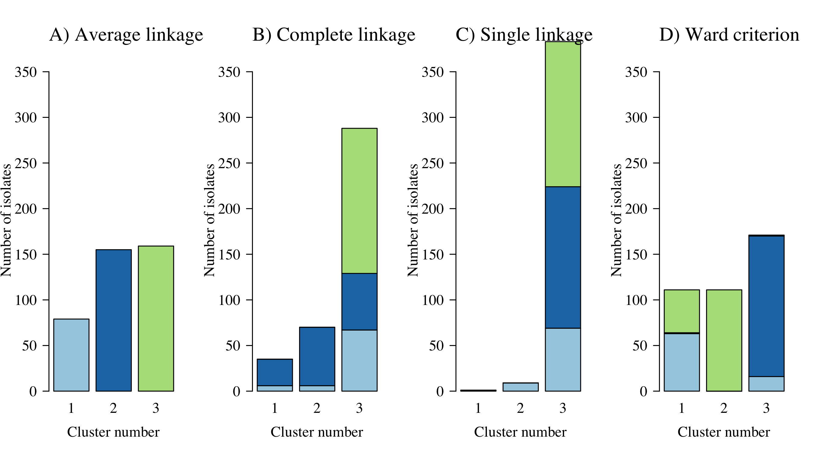

## Load meta data and pairwise distance matrices


```r
# meta data on 393 individuals in the TRAC1 study
load('RData/metadata.RData')

# 393 x 393 whole genome based pairwise 1-IBS distance matrix
load(file = 'RData/IBD_distance_matrix.RData')
IBD_WG = IBD_dist_matrix

# 393 x 393 whole genome pairwise 1-IBD distance matrix
load(file = 'RData/IBS_distance_matrix.RData')
IBS_WG = IBS_dist_matrix

# # 1468 x 1468 500,000 kb flanking region based pairwise 1-IBD distance matrix
# load(file = 'RData/Chr_13_Flanking_radius_5e+05_IBD_dist_matrix.RData')
# IBD_flanking = IBD_dist_matrix; rm(IBD_dist_matrix)

writeLines(sprintf('There are %s samples in total', nrow(metadata)))
```

```
## There are 393 samples in total
```

Overview of the samples and of the mutations (Table 1 in the paper)

```r
table(metadata$Site)
```

```
## 
##  ETH   LA NEKH  NKH   VN  WKH 
##   16   47   56   76   65  133
```

```r
table(metadata$k13Class, metadata$Site)
```

```
##            
##             ETH  LA NEKH NKH  VN WKH
##   C580Y       3   0    1  15   6 110
##   I543T       0   0    0   0  11   2
##   K13-other   0   0    1   0   1   0
##   R539T      13   1    0   2   5   8
##   V568G       0   0    0   0   1   0
##   WT          0  46   54  56  37  12
##   Y493H       0   0    0   3   4   1
```

```r
table(metadata$PLA1, metadata$Site)
```

```
##            
##             ETH LA NEKH NKH VN WKH
##   Amplified   0  0    0   2  0  70
##   WT         16 47   56  74 65  63
```

```r
table(metadata$crt_class, metadata$Site)
```

```
##          
##           ETH  LA NEKH NKH  VN WKH
##   H97Y      0   0    0   0   0   8
##   I218F     0   0    0   3   0   4
##   missing   0   0    3   6   0   8
##   no_nea   16  47   53  67  65 113
```

Make the -log_2 IBD distance matrix

```r
IBD_neglog2_WG = -log(1-IBD_WG, base = 2)
max_val = max(IBD_neglog2_WG[!is.infinite(IBD_neglog2_WG)])
IBD_neglog2_WG[IBD_neglog2_WG>max_val] = max_val
```


## Visualise whole genome pairwise distance matrices

This is Figure 1 in the paper


```r
par(las=1, mar = c(5,6,3,3), cex.axis=1.5, cex.lab=1.5, family = 'serif', bty='n')
layout(mat = matrix(c(1,2,3,4),nrow = 2,byrow = T))

h_IBS = hist(IBS_WG[upper.tri(IBS_WG)],breaks = 30,plot=F)
h_IBS$counts = log10(h_IBS$counts)
plot(h_IBS,main = '',ylab='Pairwise comparisons',xlab='1-IBS',yaxt='n', 
     col='lightgrey', border=NA)
axis(2, at = 1:5, labels = expression(10, 10^2, 10^3, 10^4, 10^5))
mtext(text='A', side = 3, adj = 0, line=0.5, cex=1.5)

h_IBD = hist(IBD_WG[upper.tri(IBD_WG)],breaks = 30,plot=F)
h_IBD$counts = log10(h_IBD$counts)
plot(h_IBD, xlab='1-IBD',ylab = 'Pairwise comparisons', 
     yaxt='n', col='lightgrey', border=NA,main='')
axis(2, at = 1:5, labels = expression(10, 10^2, 10^3, 10^4, 10^5))
mtext(text='B', side = 3, adj = 0, line=0.5, cex=1.5)

h_IBD_log = hist(IBD_neglog2_WG[upper.tri(IBD_neglog2_WG)],breaks = 30,plot=F)
h_IBD_log$counts[h_IBD_log$counts>0] = log10(h_IBD_log$counts[h_IBD_log$counts>0])
h_IBD_log$counts[h_IBD_log$counts==0] = NA
not_na_ind = complete.cases(h_IBD_log$counts)
plot(h_IBD_log, main='',ylab='Pairwise comparisons', xlab = '-log(IBD)',yaxt='n', 
     col='lightgrey', border=NA, ylim=range(h_IBD_log$counts,na.rm=T))
axis(2, at = 1:4, labels = expression(10, 10^2, 10^3, 10^4))
mtext(text='C', side = 3, adj = 0, line=0.5, cex=1.5)

plot(IBD_WG[lower.tri(IBD_WG)],  IBS_WG[lower.tri(IBS_WG)], pch='.',
     xlab = '1-IBD', ylab = '1-IBS')
mtext(text='D', side = 3, adj = 0, line=0.5, cex=1.5)
```

<!-- -->

# PCoA

Add color column to meta data corresponding to kelch mutations

```r
sort(table(metadata$k13Class))
```

```
## 
##     V568G K13-other     Y493H     I543T     R539T     C580Y        WT 
##         1         2         8        13        29       135       205
```

```r
metadata$`Kelch` = metadata$k13Class
metadata$`Kelch`[!metadata$`Kelch` %in% c('R539T','Y493H','WT','C580Y','P553L','I543T')] = 'Other'
metadata$k13colors =
  mapvalues(metadata$Kelch,
            from = unique(metadata$Kelch),
            to=brewer.pal(name = 'Set1', n = length(unique(metadata$Kelch))))
```

Compute PCoA on the distance matrices

```r
N = nrow(metadata)
K = 5
clas_scale_IBS = cmdscale(d = IBS_WG, k = N-1, eig = T, add = F)
```

```
## Warning in cmdscale(d = IBS_WG, k = N - 1, eig = T, add = F): only 248 of the
## first 392 eigenvalues are > 0
```

```r
clas_scale_IBD = cmdscale(d = IBD_WG, k = N-1, eig = T, add = F)
```

```
## Warning in cmdscale(d = IBD_WG, k = N - 1, eig = T, add = F): only 275 of the
## first 392 eigenvalues are > 0
```

```r
clas_scale_logIBD = cmdscale(d = IBD_neglog2_WG, k = N-1, eig = T, add = F)
```

```
## Warning in cmdscale(d = IBD_neglog2_WG, k = N - 1, eig = T, add = F): only 206
## of the first 392 eigenvalues are > 0
```


```r
par(las=1, bty='n', cex.axis=2, cex.lab=2, mar=c(5,5,2,2))
plot(100*clas_scale_IBS$eig[1:K]/sum(clas_scale_IBS$eig), type='l',lwd=3,
     ylim=c(0,100), xlab = 'Component number', ylab='Variance explained', xaxt='n')
axis(1, 1:K)
lines(100*clas_scale_IBD$eig[1:K]/sum(clas_scale_IBD$eig), lty=2,lwd=3)
lines(100*clas_scale_logIBD$eig[1:K]/sum(clas_scale_logIBD$eig), lty=3,lwd=3)
legend('topright', legend = c('IBS','IBD','-log2 IBD'), lty = 1:3, lwd=3, cex=2, inset=0.03, bty='n')
```

<!-- -->


Comparison of PCs 1-2 for the 3 distance metrics: this is Figure 2

```r
par(mfcol=c(3,1), mar=c(5,5,3,5), las=1, cex.lab=1.5, family = 'serif')
mycol = metadata$k13colors
mypch = as.numeric(metadata$PLA1 != 'WT')+1

#***** IBS *****
X = clas_scale_IBS$points
plot(-X[,1], X[,2], pch=mypch, bty='n',
     col=mycol, xlab = 'PC1', ylab='PC2',main='')
mtext(text='A', side = 3, adj = 0, line=0.5, cex=1.5)

legend('topleft', legend = unique(metadata$Kelch) ,inset = 0.02, bg = 'white', 
       fill = brewer.pal(name = 'Set1', n = length(unique(metadata$Kelch))), 
       cex=1.3,title = 'PfKelch')
legend('topright', legend = c('WT','Amplified'), title = 'PfPlasmepsin' ,
       inset = 0.02, bg = 'white', cex=1.3, pch = 1:2)

#***** IBD *****
X = clas_scale_IBD$points
plot(-X[,1], X[,2], pch=mypch, bty='n',
     col=mycol, xlab = 'PC1', ylab='PC2',main='')
mtext(text='B', side = 3, adj = 0, line=0.5, cex=1.5)

#***** -log_2 IBD *****
X = clas_scale_logIBD$points
plot(-X[,1], X[,2], pch=mypch, bty='n',
     col=mycol, xlab = 'PC1', ylab='PC2',main='')
mtext(text='C', side = 3, adj = 0, line=0.5, cex=1.5)
```

<!-- -->

# Tanglegram: sensitivity to metric

We do hierachical agglomerative clustering on the 1-IBS and 1-IBD distance matrices using complete linkage. 


We compare the two dendrograms using a tanglegram

```r
tanglegram(dend1 = dend_list[[1]], dend2 = dend_list[[2]], sort = T,axes=F,lab.cex=NA,
           color_lines=metadata$k13colors[order.dendrogram(dend_list[[1]])],
           highlight_distinct_edges=F,faster=T,
           lwd=.5,highlight_branches_lwd=F,main_left='1-IBS',main_right = '1-IBD')
legend('bottomright',legend = unique(metadata$Kelch), 
       fill = unique(metadata$k13colors),title='PfKelch')
```

<!-- -->

# Sensitivity to linkage function

We do hierachical agglomerative clustering on -log 2 IBD using average linkage, complete linkage, single linkage and Ward's criterion.


```r
mytitles = c('A','B','C','D')
my_color_bars = metadata$k13colors
mylabels = ''
xx = 18
dd = dend_list
par(mar=c(4,6,2,2))
for(i in 1:length(dend_list)){
  dd = dend_list[[i]]
  plot(dd, main='', ylab='', yaxt='n')
  colored_bars(colors = my_color_bars, dend = dd,
               add=T, rowLabels = mylabels, cex=4.7)

  if(i ==4){
    legend('topleft', legend = unique(metadata$Kelch),
         fill = unique(metadata$k13colors),bty='n',inset=0.03,
         title = 'PfKelch', cex=2.4)
  }
}
```

<!-- --><!-- --><!-- --><!-- -->


Aimee's suggestion for showing membership in the clusters as barplots

```r
mytitles = c('A','B','C','D')
mypch = 16*as.numeric(metadata$k13Class == 'C580Y') + 1
N = nrow(IBD_dist_matrix)
par(las=1)
par(las=1, mfrow=c(1,4))
graph_titles = c('Average linkage', 'Complete linkage', 'Single linkage', 'Ward criterion')
for(K_clusters in c(3,6,9,12)){
  clusters_list = list()
  for(i in 1:length(dend_list)){
    dd = dend_list[[i]]
    clusters_list[[i]] = cutree(tree = dd, k = K_clusters)
    clusters_list[[i]] = mapvalues(x = clusters_list[[i]], 
                                   from = as.numeric(names(sort(table(clusters_list[[i]])))), 
                                   to = 1:K_clusters)
    print(table(clusters_list[[i]]))
  }
  
  mycols = brewer.pal(n = K_clusters, name = 'Paired')
  
  
  barplot(table(clusters_list[[1]]), col = mycols, ylab = 'Number of isolates')
  if(K_clusters==3) title(graph_titles[1])
  if(K_clusters==12) title(xlab = 'Cluster number')

  for(Link_alg in 2:length(clusters_list)){
    cluster_prop = array(dim = c(K_clusters, K_clusters))
    for(kk1 in 1:K_clusters) {
      for(kk2 in 1:K_clusters){
        ind1 = clusters_list[[1]] == kk1
        ind2 = clusters_list[[Link_alg]] == kk2
        cluster_prop[kk1,kk2] = sum(ind1 & ind2)
      }
    }
    barplot(cluster_prop, col = mycols, names.arg=1:K_clusters, ylab = 'Number of isolates')
    if(K_clusters==3) title(graph_titles[Link_alg])
    if(K_clusters==12) title(xlab = 'Cluster number')

  }
  
}
```

```
## 
##   1   2   3 
##  79 155 159 
## 
##   1   2   3 
##  35  70 288 
## 
##   1   2   3 
##   1   9 383 
## 
##   1   2   3 
## 111 111 171
```

<!-- -->

```
## 
##   1   2   3   4   5   6 
##  14  18  30  35 137 159 
## 
##  1  2  3  4  5  6 
## 35 57 59 70 73 99 
## 
##   1   2   3   4   5   6 
##   1   1   1   2   9 379 
## 
##   1   2   3   4   5   6 
##  13  25  51  60  73 171
```

<!-- -->

```
## 
##   1   2   3   4   5   6   7   8   9 
##   1  12  14  17  17  18  18 137 159 
## 
##  1  2  3  4  5  6  7  8  9 
## 15 17 23 34 35 42 55 73 99 
## 
##   1   2   3   4   5   6   7   8   9 
##   1   1   1   1   1   1   2   9 376 
## 
##   1   2   3   4   5   6   7   8   9 
##   9  10  13  14  25  50  51  60 161
```

<!-- -->

```
## 
##   1   2   3   4   5   6   7   8   9  10  11  12 
##   1   1   9  12  13  14  17  17  18  18 114 159 
## 
##  1  2  3  4  5  6  7  8  9 10 11 12 
##  9 14 15 15 17 19 27 34 35 54 55 99 
## 
##   1   2   3   4   5   6   7   8   9  10  11  12 
##   1   1   1   1   1   1   1   1   1   2   9 373 
## 
##   1   2   3   4   5   6   7   8   9  10  11  12 
##   7   9   9  10  13  14  25  25  35  41  51 154
```

<!-- -->
